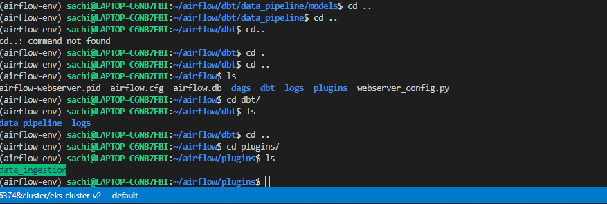
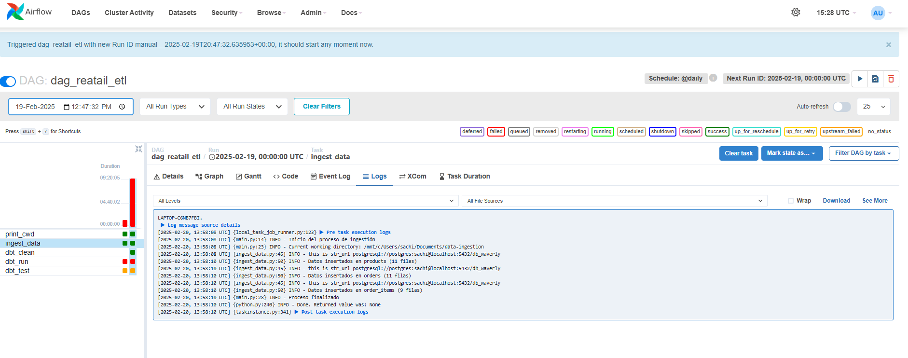
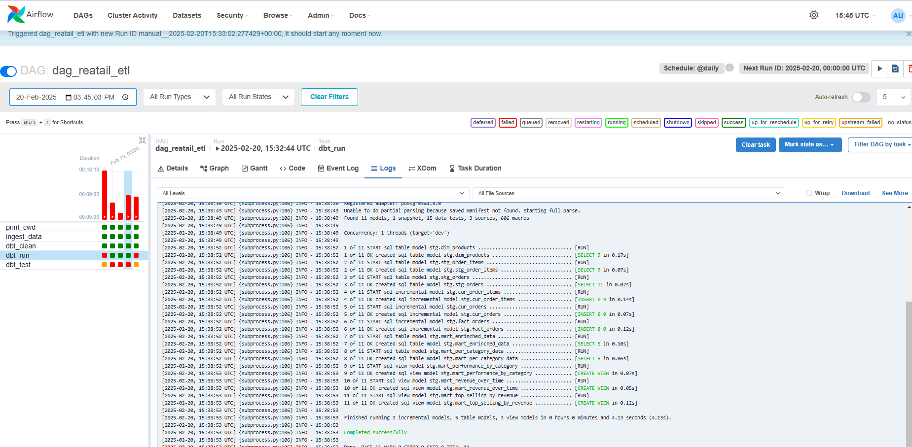
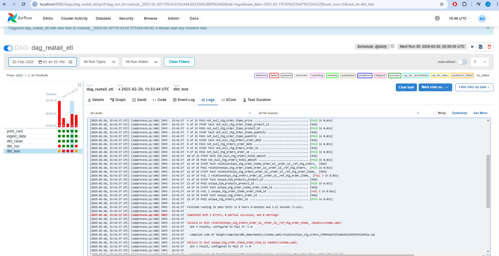
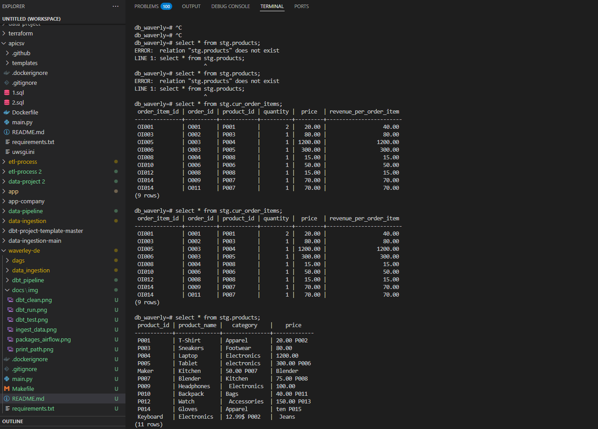

# Data Pipeline Project on WSL

## Overview

This project sets up a complete data pipeline on WSL (Windows Subsystem for Linux), integrating PostgreSQL, DBT, and Apache Airflow for end-to-end data processing. It follows three main stages:

## Table of Contents
- [Overview](#overview)
- [Prerequisites](#prerequisites)
- [Data Ingestion](#Data-Ingestion)
- [Data Transformation with DBT](#Data-Transformation-with-DBT)
- [Orchestration with Apache Airflow](#Orchestration-with-Apache-Airflow)
- [Installation](#Installation)
- [Author](#author)

---


## Overview

This application:
- Handles three specific files: `orders.csv`, `order_items.csv`, and `products.csv`.
- Validates the structure and content of the uploaded CSV files.
- Data Ingestion: Files are downloaded locally (with optional S3 integration) and ingested into PostgreSQL.
- ETL with DBT: Data is transformed and consolidated into a structured warehouse.
- Orchestration with Airflow: Apache Airflow is used to automate the pipeline execution.


---

## Data Ingestion

The data_ingestion module downloads source files (locally or from S3), enforces header consistency, and ingests them into PostgreSQL.

Sources of Data

- Orders Data: Contains transactional information about purchases.
- Order Items Data: Details about individual items in an order.
- Products Data: Information on products available in the system.

---

## Data Transformation with DBT

- The staging layer (stg) cleans and structures raw data.
- The curated layer (cur) consolidates orders and order_items using incremental tables.
- The dimensional layer (dim) stores products as a static dimension table.
- The fact layer (fact) consolidates transactional data incrementally.
- The marts layer (marts) aggregates data for reporting and business intelligence.

---

## Orchestration with Apache Airflow

Airflow automates the ETL pipeline execution using:

- PythonOperator: Runs the ingestion script.
- BashOperator dbt run: Executes DBT transformations.
- BashOperator dbt test: Validates data integrity.

---

## Installation
1. Clone this repository:
   ```make airflow_init         # Inicializa la base de datos de Airflow
      make airflow_scheduler    # Inicia el scheduler
      make airflow_webserver    # Inicia la interfaz web
      make airflow_trigger      # Ejecuta el DAG de ETL```

**Note**: before running the dag make sure to run this in order to enable TCP/IP connection with airflow and postgres:
    ```sachi@LAPTOP-C6NB7FBI:~/airflow/plugins/data_ingestion/src$ sudo -u postgres psql -c 'SHOW config_file'
       sachi@LAPTOP-C6NB7FBI:~/airflow/plugins/data_ingestion/src$ sudo vim  /etc/postgresql/16/main/postgresql.conf
       ## uncomment line listen_addresses = 'localhost'          # what IP address(es) to listen on;
       sachi@LAPTOP-C6NB7FBI:~/airflow/plugins/data_ingestion/src$ sudo systemctl restart postgressql
       ```
        Also copy and paste into a new folder at the dags level folder the dbt and plugins in order to use data_ingestion and dbt_pipeline
        

## Airflow orchestration

1. 

2. 

3. 

4. 

5. 

Configuration

    •	Update the following variables in the create_conn function in app.py:
    •	host: localhost.
    •	port: 5432.
    •	db_user: The Postgres database username.
    •	db_pass: The Postgres database password.
    •	db_name: The name of the database.

